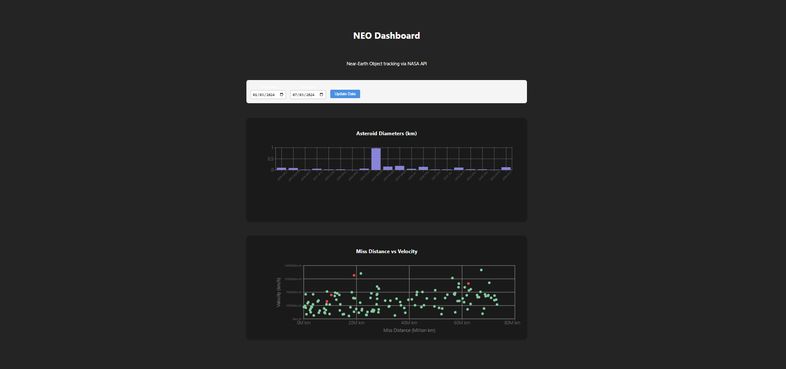
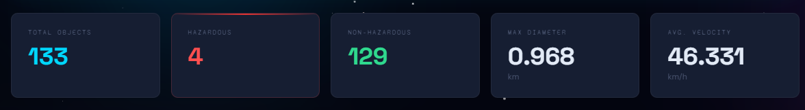
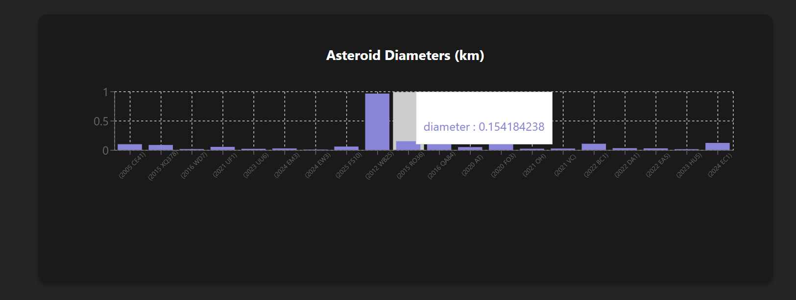
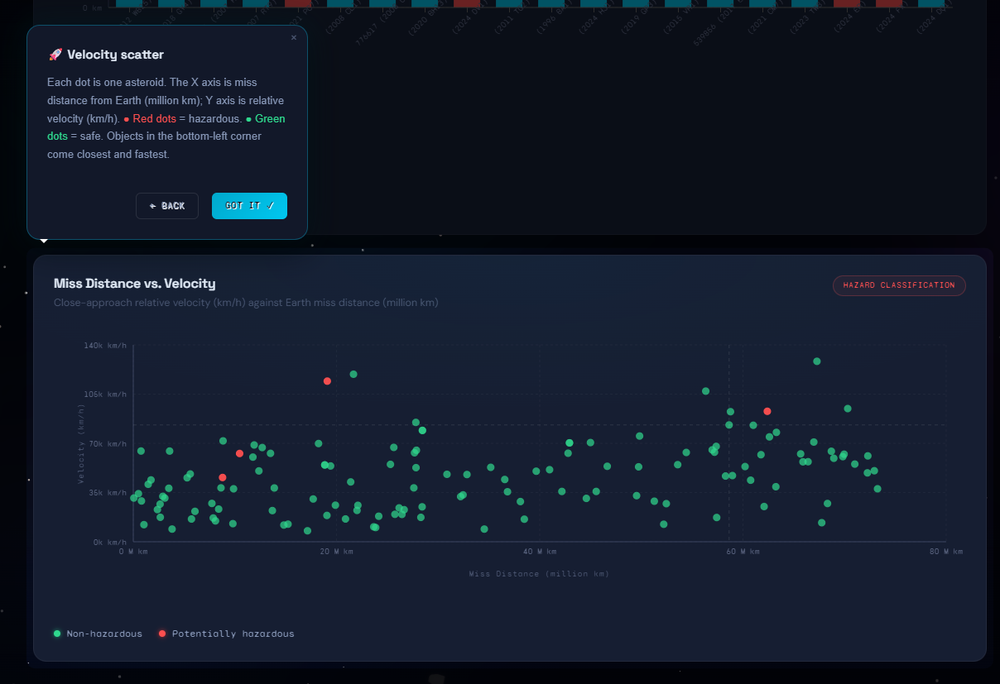

# 🛰️ NASA NEO Dashboard

Un dashboard interactivo y profesional para rastrear **Objetos Cercanos a la Tierra (NEO)** en tiempo real, utilizando la API oficial de la NASA. Desarrollado como parte del reto técnico para **Dinametra**.

**🔗 [Ver Demo en Vivo](http://nasa-dashboard-challenge.vercel.app/)**

---

## 🚀 Características

| Característica | Detalle |
|---|---|
| **Visualización dinámica** | Gráfico de barras (diámetros) + scatter plot (velocidad vs. distancia), construidos con Recharts |
| **Clasificación de riesgo** | Asteroides potencialmente peligrosos destacados en rojo en ambos gráficos |
| **Filtros validados** | Rango de fechas con validación estricta de 7 días (límite de la API de NASA) |
| **Tour guiado** | Onboarding interactivo con Driver.js que explica cada sección al primer acceso |
| **Stats en vivo** | Tarjetas con total de objetos, conteo de peligrosos, diámetro máximo y velocidad promedio |
| **Fondo cósmico** | Entorno animado de tres zonas: starfield en canvas, aurora tipo lava-lamp y cinturón de asteroides |
| **Diseño responsivo** | Layout fluido para móviles, tablets y escritorio |
| **Accesibilidad** | 32+ atributos ARIA, navegación por teclado, soporte para lectores de pantalla |

---

## 🛠️ Stack Tecnológico

- **React 19** + **Vite 7** — frontend moderno con HMR
- **Recharts 3** — gráficos interactivos con tooltips personalizados
- **Driver.js 1.x** — tour guiado cargado vía CDN (sin overhead en el bundle)
- **CSS Custom Properties** — sistema de diseño completo con 50+ tokens
- **Vitest** — pruebas unitarias nativas para Vite
- **Vercel** — hosting y CI/CD

---

## 📐 Arquitectura

```
nasa-dashboard-challenge/
├── index.html                                ← meta tags + font preconnects
├── README.md
└── src/
    ├── App.jsx                               ← entry point, solo maneja estado de fecha
    ├── index.css                             ← sistema de diseño completo + cosmic CSS
    └── components/
        ├── CosmicBackground.jsx              ← fondo animado (canvas + CSS, 3 zonas)
        ├── Dashboard.jsx                     ← layout principal, loading/error states
        ├── DashboardTour.jsx                 ← tour guiado con Driver.js (CDN lazy)
        ├── DateFilter.jsx                    ← filtro de fechas con validación 7 días
        ├── ChartContainer.jsx                ← card wrapper reutilizable para gráficos
        ├── DiameterChart.jsx                 ← gráfico de barras de diámetros
        ├── VelocityScatter.jsx               ← scatter plot velocidad/distancia
        ├── SummaryStats.jsx                  ← tarjetas de estadísticas derivadas
        └── ErrorBoundary.jsx                 ← captura de errores de renderizado
    hooks/
    └── useNeoWsData.js                       
    services/
    └── neowsAPI.js                           
```


**Decisiones arquitectónicas clave:**
- Los datos se aplanan una sola vez en `Dashboard` con `useMemo` y se comparten hacia abajo, evitando `Object.values().flat()` repetido en cada hijo
- Los transformadores de datos de cada gráfico viven en hooks internos (`useChartData`, `useScatterData`) — la UI y la lógica están separadas
- `DashboardTour` carga Driver.js de forma diferida desde CDN únicamente cuando el usuario activa el tour

---

## 📸 Capturas de Pantalla

| Vista inicial | Resumen de datos |
|---|---|
|  |  |

| Gráfico de diámetros | Scatter velocidad |
|---|---|
|  |  |

---

## ⚙️ Configuración Local

```bash
# 1. Clona el repositorio
git clone <repo-url>
cd nasa-dashboard-challenge

# 2. Crea el archivo de entorno
echo "VITE_NASA_API_KEY=tu_clave_aqui" > .env
# Obtén tu clave gratis en: https://api.nasa.gov/

# 3. Instala dependencias
npm install

# 4. Inicia el servidor de desarrollo
npm run dev
```

> **Nota:** La API de NASA tiene un límite de **7 días** por consulta. El dashboard valida y clampea automáticamente el rango seleccionado.

---

## 🧪 Testing

Pruebas unitarias implementadas con **Vitest** (nativo para Vite):

```bash
npm run test
```

    **¿Por qué Vitest en lugar de Jest?**
    - Comparte la misma configuración de transformación que Vite → sin inconsistencias entre entornos
    - HMR interno → ejecución instantánea tras cada cambio
    - Soporte nativo de ESM y JSX 

**Alcance actual:**
- Validación del servicio NASA API (formatos de fecha, manejo de errores HTTP)
- Sanidad de componentes ante datos vacíos o fallidos

---

## ♿ Accesibilidad

- **Navegación por teclado** completa en todos los elementos interactivos
- **32+ atributos ARIA** (`aria-label`, `aria-live`, `aria-invalid`, `aria-busy`, `aria-describedby`)
- Mensajes de error con `role="alert"` + `aria-live="assertive"` para lectores de pantalla
- Respeto a `prefers-reduced-motion` — todas las animaciones se pausan si el usuario lo prefiere
- Contraste de color WCAG AA en texto principal y de estado

---

## 🌐 Compatibilidad de Navegadores

| Navegador | Estado |
|---|---|
| Chrome 100+ | ✅ Completo |
| Firefox 100+ | ✅ Completo |
| Safari 15+ | ✅ Completo |
| Edge 100+ | ✅ Completo |

Vendor prefixes aplicados para date inputs (`-webkit-calendar-picker-indicator`, `-moz-calendar-picker-indicator`) y normalización de botones en Safari (`-webkit-appearance: none`).

---

*Desarrollado con ❤️ para el proceso de selección de Dinametra.*